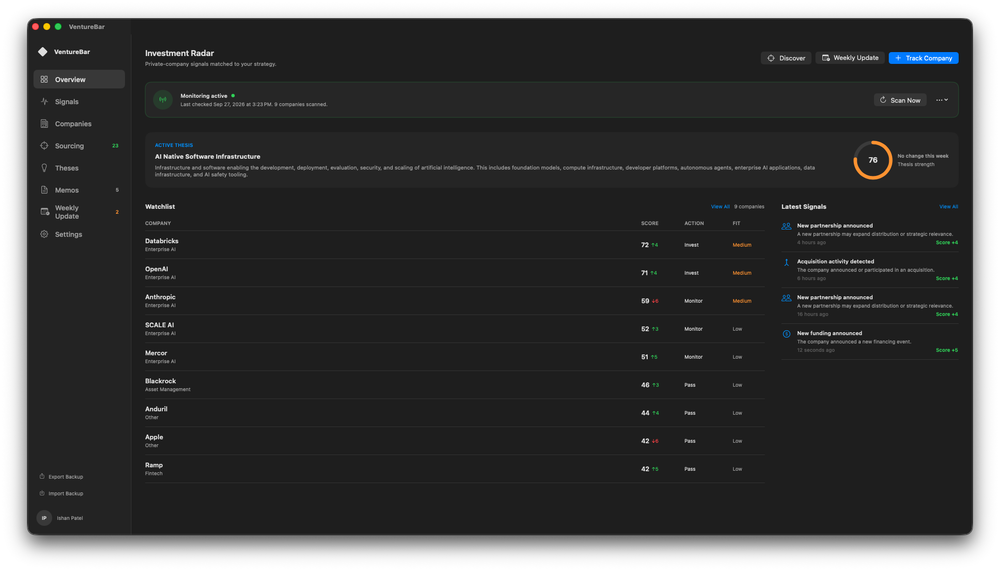
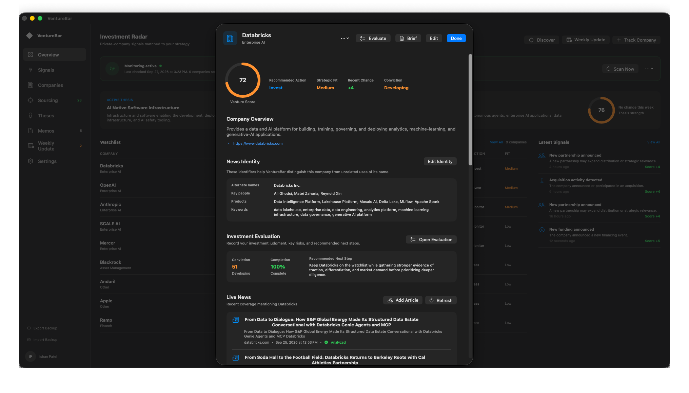
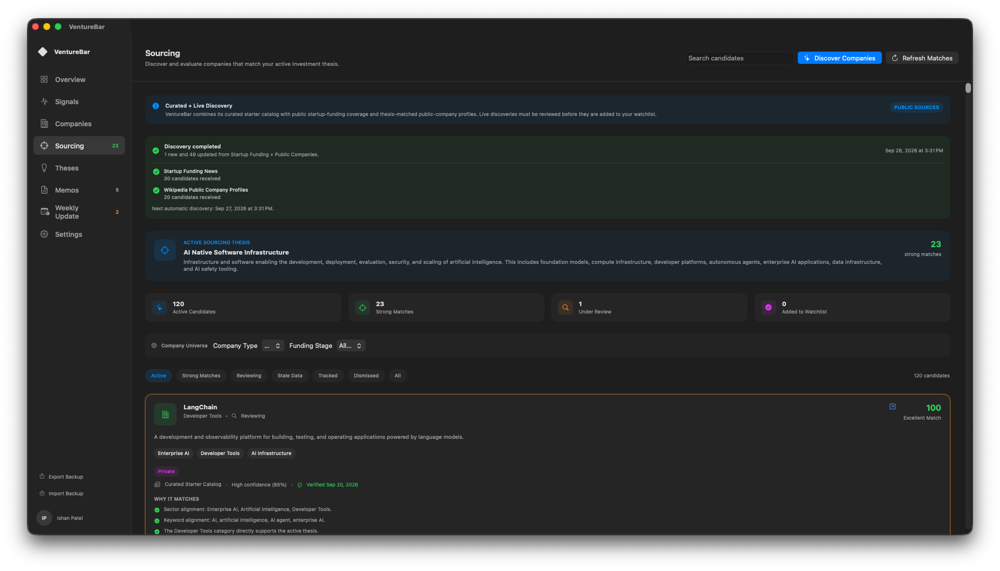
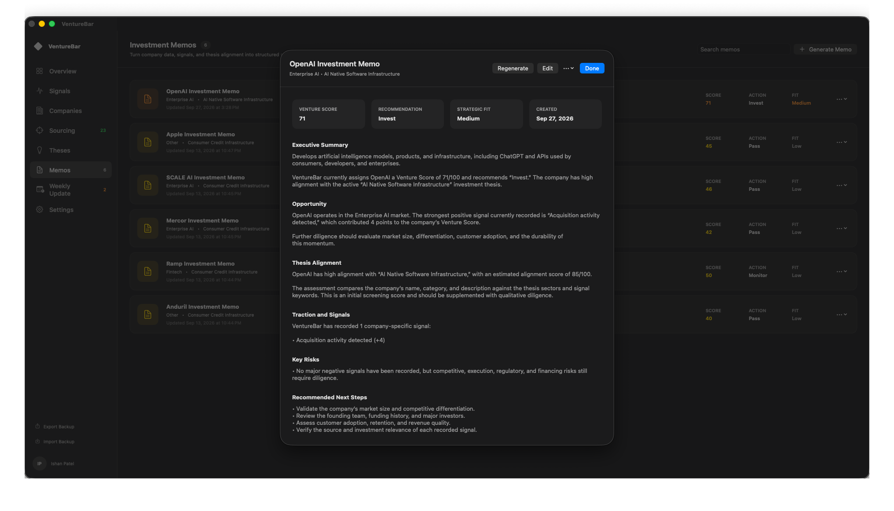

# VentureBar

VentureBar is a native macOS investment-research workspace for discovering, monitoring, and evaluating companies against an active investment thesis.

It brings company sourcing, news monitoring, investment signals, evaluations, memos, and weekly portfolio reviews into one evidence-driven workflow.

## Product Preview

### Investment Radar

### Company Diligence

### Thesis-Based Sourcing

### Investment Memo

## Why I Built It

Investment research is often fragmented across news feeds, spreadsheets, company websites, notes, and disconnected scoring systems.

VentureBar was built to organize those activities into a repeatable workflow. Its purpose is not to replace investor judgment, but to make that judgment easier to explain, update, and support with evidence.

## Core Workflow

1. Create and activate an investment thesis.
2. Discover public and private companies from public sources.
3. Rank candidates based on thesis alignment.
4. Review candidates before adding them to the watchlist.
5. Monitor tracked companies for relevant news.
6. Convert meaningful developments into scored signals.
7. Evaluate conviction, risks, and recommended next steps.
8. Generate and edit investment memos.
9. Review portfolio developments through weekly updates.
10. Export or restore the complete workspace.

## Key Features

### Thesis-Based Sourcing

- Discovers startup-funding activity and public-company profiles.
- Ranks companies against the active investment thesis.
- Supports company-type and funding-stage filters.
- Explains why each candidate matches the thesis.
- Separates discovered, reviewing, tracked, and dismissed candidates.
- Displays source, confidence, publication, and verification information.
- Identifies sourcing data that has become stale.
- Reports the health of each discovery source independently.

### Automated Company Monitoring

- Periodically checks tracked companies for new coverage.
- Supports configurable news and sourcing schedules.
- Records previous checks and upcoming refreshes.
- Preserves results when one discovery source fails.
- Provides manual refresh controls.

### Identity-Aware News Relevance

- Builds a saved news identity for every tracked company.
- Uses company names, aliases, tickers, websites, products, key people, descriptions, and keywords.
- Uses Apple’s Natural Language framework for local classification.
- Distinguishes companies from similarly named organizations and generic words.
- Rejects irrelevant articles before they affect the Venture Score.
- Supports manual article import and relevance review.

### Signals and Venture Score

- Converts material company events into structured signals.
- Applies positive or negative Venture Score changes.
- Prevents the same event from being scored repeatedly.
- Preserves the source article behind every news-generated signal.
- Allows signals to be removed while reversing their score impact.
- Sends notifications when meaningful signals are detected.

### Evaluations and Memos

- Records conviction, risks, completion, and recommended next steps.
- Keeps company evaluations synchronized with the watchlist.
- Generates structured investment-memo drafts.
- Allows every memo section to be edited.
- Persists evaluations and memos between launches.

### Weekly Updates

- Summarizes recent company and evaluation activity.
- Creates a repeatable review workflow for the tracked portfolio.

### Backup and Restore

- Exports the complete VentureBar workspace.
- Supports merge and replace restore modes.
- Preserves companies, signals, theses, evaluations, memos, sourcing candidates, manual articles, and news-processing history.
- Maintains compatibility with older backups.

## Reliability and Transparency

VentureBar includes:

- Source-level discovery health.
- Candidate verification dates.
- Stale-data warnings.
- Duplicate company and article protection.
- Event cooldown and signal deduplication.
- Persistent monitoring history.
- Graceful partial-source failure handling.
- Local backup and restore.
- Debug, Release, and standalone archive validation.

## Technology

- Swift
- SwiftUI
- Observation
- Swift Concurrency
- Apple Natural Language
- UserNotifications
- URLSession
- XMLParser
- Codable
- UserDefaults

VentureBar is built as a native macOS application with a standard dashboard window and menu-bar access.

## Current Public Sources

- Startup-funding news coverage
- Wikipedia public-company profiles
- Google News RSS
- Company websites and public page metadata
- Manually imported news articles

Live sourcing candidates must be reviewed before they are added to the tracked-company watchlist.

## Privacy

Company identity matching and Natural Language relevance analysis run locally on the Mac.

VentureBar stores its workspace locally and allows the user to create a portable backup. External requests are made only when retrieving public sourcing, company-website, or news information.

## Future Development

Potential future improvements include:

- Additional verified company and funding-data providers
- Broader Fortune 500 and public-market coverage
- Historical score and conviction charts
- Team collaboration and shared diligence workflows
- Secure cloud synchronization
- Exportable PDF investment memos
- Notarized distribution outside Xcode

## Disclaimer

VentureBar is an investment-research and workflow tool. Its scores, signals, sourcing matches, and generated materials are research aids and do not constitute investment advice.

## Author

Built by Ishan Patel as a product and investing project focused on evidence-driven venture research.

## Copyright

Copyright © 2026 Ishan Patel. All rights reserved.

This source code is publicly available for portfolio review and educational inspection only. No permission is granted to copy, modify, distribute, sublicense, or use this software commercially without written authorization.
